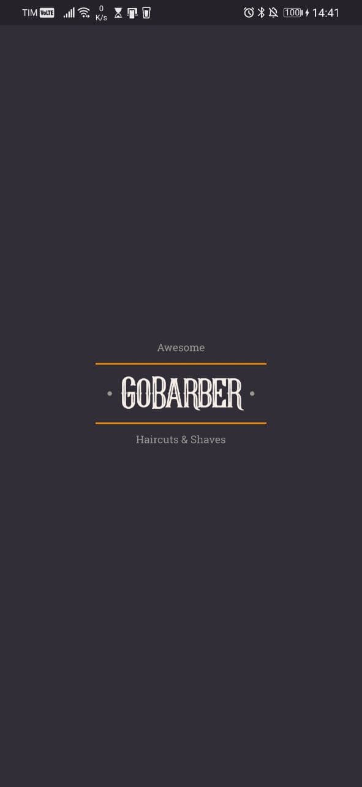

# gobarber

Clone do Projeto GoBarber da Rocketseat em Flutter!

# screenshots

# Instruções

- Para executar a codegen do MobX use o comando `flutter pub run build_runner watch` no Terminal na raiz do seu projeto.
